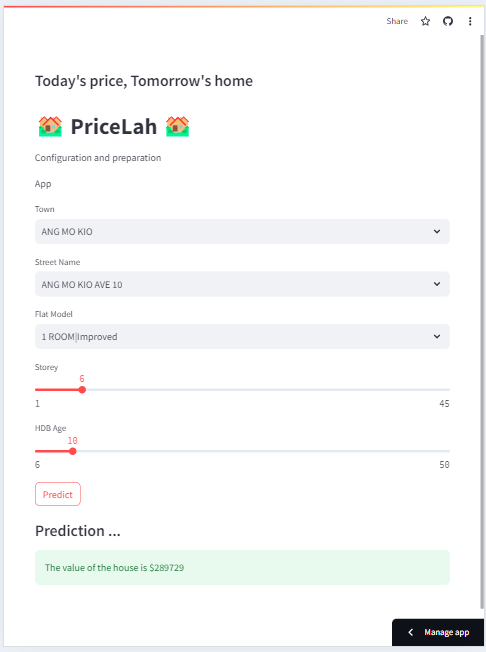

# Streamlit-PriceLah-HDB-Resale-Price-Estimator

PriceLah is a web app implemented on Streamlit as a proof of concept (POC) to showcase a HDB resale price estimator backed by a prediction model. The app is hosted on Streamlit IO, which can be accessed through this [link](https://pricelah-hdb-resale-price-estimator.streamlit.app/)

This app leverages on a regression model developed in project [HDB Resale Price Estimator](https://github.com/cy-chin/HDB-Resale-Price-Estimator).

